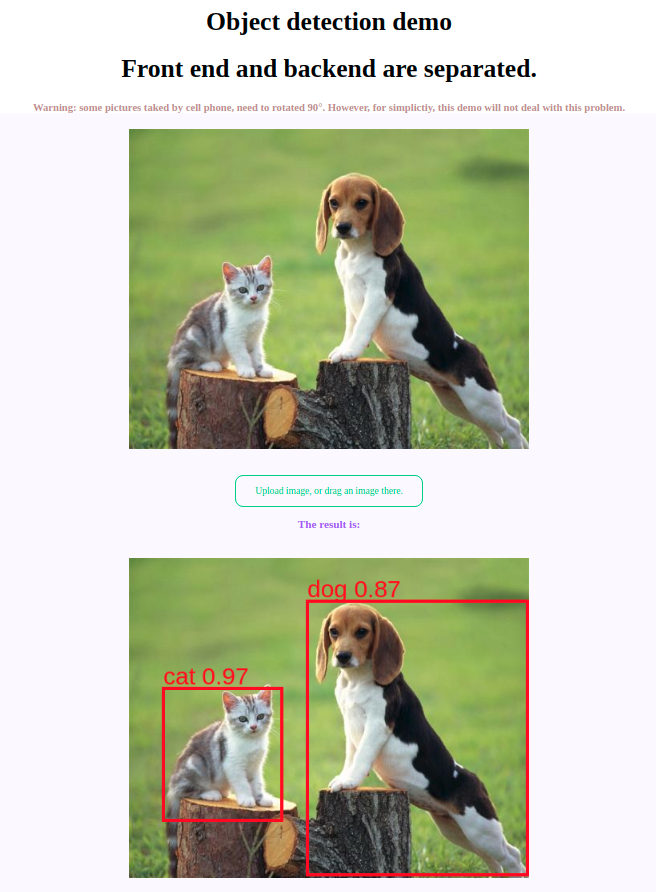

# Flask with tensorflow object detection

- Frontend and backend are separated, not with common flask template. 



Since flask is very simple and wroted by python, we build it with only a few lines of code.

## How to run.
Step 1: Open the server with 
```
python app.py

```
The server is setup on port 127.0.0.1:5000.

Step 2: Open the front end page.

If you want to use python.
```
// python3
python -m http.server
// python2
python -m SimpleHTTPServer

```
If you prefer Node.js
```
npm install serve -g // install serve
serve // this will open a mini web serve
// or http-serve
npm install http-server -g
http-server
```

## Run by Docker

### Quick Start：

If you have docker installed, you can quickly test demo:

`sudo docker run -p 127.0.0.1:5000:5000 bonsai/flaskobjectdection`

### Docker Build：

If you want to build your own docker image, you can modify the Dockerfile and execute the command:

`docker build -t bonsai/flaskobjectdection .`

`sudo docker run -p 127.0.0.1:5000:5000 bonsai/flaskobjectdection`

